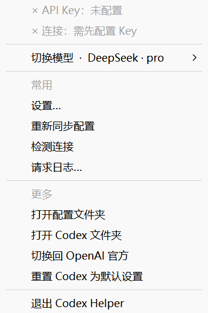
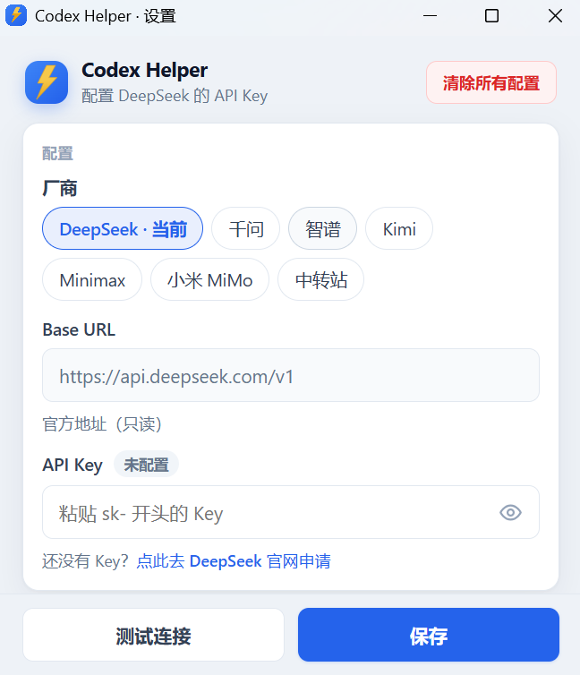

# Codex Helper

> 轻量 Windows 托盘工具 — 让 **OpenAI Codex CLI** 一键切换到 DeepSeek、通义千问、智谱、Kimi、MiniMax 等国产大模型。

> **零门槛设计**：双击安装 → 自动配置 → 托盘右键选模型 → 开始用 Codex。
> 全程不需要打开终端、不需要改配置文件、不需要懂技术。

---

## 界面预览

右键系统托盘图标，即可切换模型、打开设置或同步配置：



托盘 →「设置…」打开 API Key 配置窗口（厂商 Chip 切换、Base URL、测试连接）：



---

## 这是给谁用的？

- **小白用户**：第一次接触 Codex，只想用 DeepSeek 替代 OpenAI 省钱
- **怕折腾的用户**：看到 `~/.codex/config.toml` 就头大
- **多账号用户**：在 DeepSeek、通义、Moonshot 之间快速切换

如果你已经是命令行高手，也可以走 [高级模式](#高级模式cli)。

---

## 一图看懂

```
┌──────────────────────────────────────────────────────────┐
│  系统托盘  ┌───┐                                          │
│            │ ⚡ │  ← 右键点这里                             │
│            └───┘                                          │
│       × API Key：未配置                                     │
│       × 连接：需先配置 Key                                  │
│       ─────────────────                                    │
│       切换模型 · DeepSeek · pro  >   ← 厂商 → 具体型号      │
│       ─────────────────                                    │
│       常用                                                 │
│         设置…                                              │
│         重新同步配置 / 检测连接 / 请求日志…                   │
│       更多  → 配置文件夹、切回 OpenAI 官方…                   │
│       ─────────────────                                    │
│       退出 Codex Helper                                    │
└──────────────────────────────────────────────────────────┘
                       ↓ 托盘里切换模型
┌──────────────────────────────────────────────────────────┐
│  Codex Desktop / CLI  →  Codex Helper 代理  →  模型 API   │
└──────────────────────────────────────────────────────────┘
```

**就这么简单：装上 → 托盘里填 Key、选模型 → 在 Codex 里用。**

---

## 三步上手

### 第 1 步：下载安装

去 [Releases 页面](https://github.com/xqnode/codex-helper/releases) 下载：

| 系统 | 文件 | 操作 |
|------|------|------|
| **Windows** | `CodexHelper-Setup-x.x.x.exe` | 双击 → 一路下一步 |
| **macOS** | `CodexHelper-x.x.x.dmg` | 拖到「应用程序」 |
| **Linux** | `CodexHelper-x.x.x.AppImage` | 双击运行 |

> 安装时会自动：开机启动、写入 Codex 配置、注册系统托盘图标。

### 第 2 步：填 API Key（首次启动自动弹出）

首次启动时，Codex Helper 会**自动检测**你的环境：

- ✅ 已装 Codex？— 自动写入代理配置
- ✅ 已有 `DEEPSEEK_API_KEY` 环境变量？— 自动读取
- ✅ 都没有？— 弹出引导窗口：

```
┌────────────────────────────────────────────────┐
│  欢迎使用 Codex Helper                          │
│                                                │
│  请选择一个模型：                                │
│  ● DeepSeek（推荐，性价比最高）                  │
│  ○ 通义千问                                     │
│  ○ Moonshot                                    │
│                                                │
│  粘贴你的 API Key:                              │
│  ┌──────────────────────────────────────────┐  │
│  │ sk-...                                   │  │
│  └──────────────────────────────────────────┘  │
│  👉 还没有 Key？[点这里申请 DeepSeek Key]      │
│                                                │
│  [测试连接]                    [完成]            │
└────────────────────────────────────────────────┘
```

### 第 3 步：打开 Codex 就能用

```bash
codex
```

完成。**不需要任何额外配置。**

切换模型？**托盘切换厂商通常无需重启**（详见 [常见问题](#faq-model-switch)）。

---

## 小白友好设计

我们把所有「技术门槛」都铲平了：

| 你担心的事 | Codex Helper 怎么做 |
|-----------|---------------------|
| 不知道 Codex 装没装 | 启动时自动检测，没装会给下载链接 |
| 不知道去哪申请 Key | 每个模型旁边都有「点此申请」直达官网 |
| 不知道 Key 填对没 | 输入框实时校验格式，填错变红 |
| 怕改坏配置文件 | 全程 GUI，自动备份 10 份历史 |
| 报错看不懂英文 | 所有错误翻译成中文 + 给出具体建议 |
| 不知道当前用的哪个模型 | 托盘图标颜色区分（蓝=DeepSeek，绿=通义...）+ 鼠标悬停显示 |
| 切换后没生效 | 自动检测 Codex 进程，提示「请重启 Codex」并提供一键操作 |
| 想回到 OpenAI 官方 | 托盘菜单 → 「恢复官方登录」一键完成 |
| 后台代理怎么停 | 退出托盘程序 = 自动停代理；下次开机自动启动 |

---

## 友好错误提示示例

❌ 不好：
```
Error: 401 Unauthorized
```

✅ Codex Helper：
```
┌────────────────────────────────────────────────┐
│  ⚠ DeepSeek API Key 无效                       │
│                                                │
│  可能原因：                                      │
│  • Key 被复制时多了空格或换行                    │
│  • Key 已过期或被删除                            │
│  • DeepSeek 账户余额不足                         │
│                                                │
│  [重新填写 Key]    [打开 DeepSeek 控制台]        │
└────────────────────────────────────────────────┘
```

---

## 支持的模型

| 模型 | 推荐场景 | 申请 Key |
|------|---------|---------|
| **DeepSeek** | 性价比最高，推荐首选 | [platform.deepseek.com](https://platform.deepseek.com/) |
| **通义千问** | 阿里生态，国内速度快 | [dashscope.aliyun.com](https://dashscope.aliyun.com/) |
| **Moonshot** | 长上下文优秀 | [platform.moonshot.cn](https://platform.moonshot.cn/) |
| **智谱 GLM** | 中文能力强 | [bigmodel.cn](https://www.bigmodel.cn/) |
| **中转站** | 任何 OpenAI 兼容 API | — |

> 中转站端点也是在 GUI 里填，不用编辑配置文件。

---

## 设置窗口（迷你 GUI）

托盘右键 → 「设置」打开，包含：

- **模型管理**：添加 / 删除 / 编辑模型预设
- **API Key 管理**：所有 Key 集中管理，掩码显示
- **代理设置**：端口（首次初始化随机分配 10000-65535）、监听地址（默认无需改）
- **开机启动**：开关
- **导出 / 导入**：备份你的配置到其他电脑
- **关于**：版本、检查更新、查看日志

整个窗口预计 < 500 行代码，绝不臃肿。

---

## 工作原理（可跳过）

```
┌─────────────┐   1. Codex 永远连本地代理   ┌────────────────┐
│  Codex CLI  │ ──────────────────────────► │  Codex Helper  │
│             │   http://127.0.0.1:随机5位端口  │   (托盘进程)    │
└─────────────┘                              └────────┬───────┘
                                                      │
                              2. 代理根据你的选择转发   │
                                                      ▼
                              ┌───────────┬──────────┬──────────┐
                              ▼           ▼          ▼          ▼
                         DeepSeek      通义        Moonshot   中转站
```

- Codex 的 `~/.codex/config.toml` 一次性写好，永不再改
- 切换模型 = 切换代理的转发目标，**Codex 完全无感知**
- 代理自动处理 Responses API 与 Chat Completions 的格式转换

---

## 高级模式（CLI）

如果你喜欢命令行，也可以用 CLI 控制托盘程序：

```bash
codex-helper use deepseek      # 切换模型
codex-helper status            # 查看当前状态
codex-helper test              # 测试当前模型连通性
codex-helper list              # 列出所有模型
codex-helper restore-openai    # 恢复 OpenAI 官方
codex-helper doctor            # 一键诊断
```

CLI 和托盘共享同一个后端，命令立即反映到托盘图标。

---

## 安装包做了什么

为了真正「双击下一步」，安装包会自动完成：

1. 安装主程序到 `Program Files\CodexHelper\`（Windows）
2. 添加开机启动项（可在设置中关闭）
3. 注册 `codex-helper://` Deep Link（用于 Key 一键导入）
4. **自动备份** 现有的 `~/.codex/config.toml` 到 `~/.codex-helper/backups/`
5. 注入代理配置到 `~/.codex/config.toml`
6. 在系统托盘启动主程序
7. 弹出首次引导窗口

**全程无需打开终端。**

---

## 卸载也很干净

Windows 控制面板卸载 / macOS 拖到废纸篓，自动：

- ✅ 还原 `~/.codex/config.toml` 到安装前状态（从备份）
- ✅ 移除开机启动项
- ✅ 询问是否保留 `~/.codex-helper/` 配置目录

**不残留任何东西。**

---

## 与 CC Switch 的区别

| | CC Switch | Codex Helper |
|---|-----------|--------------|
| 定位 | 7 种 AI 工具全能管理器 | **专注 Codex** |
| 体积 | 桌面应用 ~50MB | **托盘 ~10MB** |
| 上手成本 | 需要理解 Provider 概念 | **零概念，选模型就行** |
| 适合人群 | 多工具高级用户 | **小白 + 只用 Codex 的人** |
| 学习曲线 | 中等 | **几乎为零** |

如果你只用 Codex，Codex Helper 更轻、更专、更省心。

---

## 数据存储

| 路径 | 内容 |
|------|------|
| `~/.codex-helper/config.json` | 当前模型、端口等设置 |
| `~/.codex-helper/keys.enc` | **加密存储**的 API Keys（不明文） |
| `~/.codex-helper/backups/` | Codex 配置自动备份（保留 10 份） |
| `~/.codex-helper/logs/` | 运行日志（出问题时上传） |

**所有数据仅在本地，不上传任何服务器。**

---

## 开发路线

| 阶段 | 目标 | 状态 |
|------|------|------|
| **M1** | 托盘程序骨架 + 内置代理 + DeepSeek 预设 | ⏳ |
| **M2** | 首次引导窗口 + Key 加密存储 + 自动检测 | ⏳ |
| **M3** | 一键安装包 (Win/macOS/Linux) + 自动备份恢复 | ⏳ |
| **M4** | 通义/Moonshot/智谱预设 + 设置窗口 + 中文报错 | ⏳ |
| **M5** | CLI 高级模式 + 自动更新 + 日志面板 | ⏳ |

---

## 技术栈（开发者）

- **核心**：Rust（小体积、跨平台、单 exe）
- **托盘**：`tray-icon` + `tao`（无需 Electron/Tauri 全套）
- **设置窗口**：原生 webview（仅在打开时加载，~3MB）
- **代理**：`hyper` + `tokio`
- **打包**：Windows Inno Setup / macOS dmg / Linux AppImage

预计单文件 < 10MB，内存占用 < 30MB。

---

## 交流群

扫码加入 **AI 交流群**（企业微信），交流 Codex 使用心得、反馈问题：

<p align="center">
  
</p>

---

## 贡献

欢迎 Issue 和 PR，尤其欢迎：

- 新模型预设（附 base_url + 测试通过截图）
- 中文报错文案优化
- 小白用户的反馈（你卡在哪一步了？）

---

## 常见问题

**Q：装上后 Codex 怎么没反应？**
A：看任务栏右下角是否有 Codex Helper 托盘图标（圆角蓝底 + 金色闪电）。没有的话，开始菜单搜「Codex Helper」启动一次；便携版请双击 `codex-helper.exe`（会自动启动托盘）。

**Q：便携版 zip 解压后双击 exe 没反应？**
A：新版已支持双击直接启动。若仍无托盘，在 PowerShell 进入解压目录执行：

```powershell
.\codex-helper.exe start
```

首次使用建议先执行 `.\codex-helper.exe init`，再 `start`。

**Q：安装版和 zip 便携版有什么区别？**
A：功能相同，都是同一个 `codex-helper.exe`。安装版会写入开始菜单、支持卸载程序，并可选开机自启；zip 解压即用，适合不想装软件的用户。

**Q：升级或重装后，图标还是旧的（蓝色圆形 / 模糊）？**
A：多半是 **Windows 图标缓存** 没刷新——同一路径反复覆盖安装时，资源管理器和任务栏可能仍显示旧图标，即使 exe 已是新版。安装包结束时会自动执行 `ie4uinit.exe -show`；若仍不对，在 PowerShell 执行：

```powershell
ie4uinit.exe -show
taskkill /IM explorer.exe /F; start explorer.exe
```

仍无效可**注销或重启电脑**。正确图标应为**圆角蓝底渐变 + 金色闪电**（与设置页左上角一致）。

**Q：设置窗口打不开？**
A：需先启动托盘代理。托盘 →「设置…」，或先运行 `codex-helper start`，再执行 `codex-helper settings`。若提示端口占用，说明已有实例在跑，在任务栏找到托盘图标即可。

**Q：任务管理器里有两个 `codex-helper.exe`？**
A：可能同时跑了**安装版 + zip 便携版**，或旧开机自启路径未删。任务管理器 → 右键 → 打开文件所在位置，保留一份即可；检查 `shell:startup` 里是否有多余快捷方式。

**Q：下载后 Windows 提示「已保护你的电脑」？**
A：安装包未数字签名，属正常情况。点「更多信息」→「仍要运行」。仅建议从 [GitHub Releases](https://github.com/xqnode/codex-helper/releases) 下载。

**Q：可以同时用 OpenAI 官方和 DeepSeek 吗？**
A：可以。托盘 → 更多 →「切换回 OpenAI 官方」，或 CLI 执行 `codex-helper restore-openai`。

**Q：如何清除所有配置？**
A：托盘 → 设置 → 右上角「清除所有配置」。会删除 API Key、厂商选择与请求日志；之后需重新填 Key 并重启 Codex Desktop。

**Q：切换模型需要重启 Codex 吗？**

<a id="faq-model-switch"></a>

**Codex Helper 本身不用重启**，托盘切换后代理会一直运行。

| 操作 | 需要重启 Codex？ |
|------|------------------|
| 托盘切换厂商（DeepSeek → 千问 等） | 通常**不需要**，新开一条对话即可 |
| 设置里改具体型号或 API Key | **建议**完全退出并重新打开 Codex Desktop |
| 切换后仍不对 | 完全退出 Desktop 再打开，或托盘 →「重新同步配置」 |

说明：

- **托盘切换厂商**：会立刻热更新代理、写入 `~/.codex/config.toml`、同步模型目录和 Desktop 会话库，下一条消息即走新厂商。
- **设置里改型号**（如 V4 Flash → V4 Pro）：保存后配置已更新，但 Desktop 可能缓存旧 UI，因此建议重启。
- **在 Codex 里点选模型**：选项来自 Helper 写入的目录，但**实际调用以 Helper 当前配置为准**；改型号请走 **托盘 → 设置… → 保存**。

若切换后没生效：先在 Codex 里**新开对话**试一次；仍不对则**完全退出 Codex Desktop**（任务栏右键退出，不要只关窗口）。

**Q：中转站 Base URL 怎么填？**
A：填 OpenAI 兼容网关地址，需带 `/v1`，例如 `http://your-host:8080/v1`。官方厂商的 Base URL 在设置里只读，无需修改。

**Q：一键诊断怎么用？**
A：PowerShell 或 cmd 执行 `codex-helper doctor`，会检查配置目录、Codex 配置、API Key、环境变量与代理是否在运行。

**Q：会不会偷我的 API Key？**
A：源代码开源，Key 存于本地 `%USERPROFILE%\.codex-helper\`，请求只发往你选的官方端点。

**Q：付费吗？**
A：完全免费，MIT 协议。模型 API 费用付给各模型厂商。

---

## 许可证

MIT © 2026

---

## 免责声明

本项目为非官方工具，与 OpenAI、DeepSeek 等公司无关联。请遵守各模型服务商使用条款；API Key 仅存于本地，请妥善保管。
